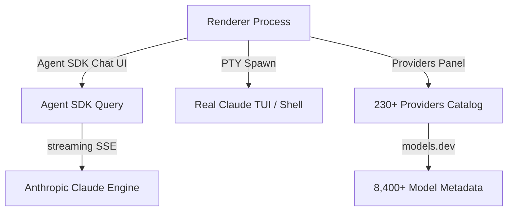

<!-- Professional Futuristic Interactive README -->
<div align="center">
<svg width="720" height="220" viewBox="0 0 720 220" xmlns="http://www.w3.org/2000/svg" aria-label="CCE Futuristic Header">
  <defs><linearGradient id="heroGrad" x1="0" y1="0" x2="1" y2="1"><stop offset="0%" stop-color="#0f0c29"/><stop offset="50%" stop-color="#302b63"/><stop offset="100%" stop-color="#24243e"/></linearGradient></defs>
  <rect width="720" height="220" fill="url(#heroGrad)" rx="20"/>
  <circle cx="120" cy="100" r="60" stroke="#00d4ff" stroke-width="1.5" fill="none" opacity="0.6"/>
  <circle cx="600" cy="120" r="70" stroke="#ff6b6b" stroke-width="1.2" fill="none" opacity="0.5"/>
  <rect x="320" y="55" width="80" height="60" rx="8" fill="#1a1a2e" stroke="#00d4ff" stroke-width="2"/>
  <text x="360" y="85" text-anchor="middle" font-family="monospace" font-size="22" fill="#00d4ff">&gt;_ AI</text>
  <text x="360" y="105" text-anchor="middle" font-family="sans-serif" font-size="8" fill="#a0a0c0">CC ENHANCED</text>
</svg>

# Claude Code Enhanced (CCE)

<p align="center">
  <a href="https://www.npmjs.com/package/claude-code-enhanced"></a>
  <a href="https://github.com/printezy247/claude-code-enhanced/blob/main/LICENSE"></a>
  <a href="https://github.com/printezy247/claude-code-enhanced"></a>
  <a href="https://github.com/printezy247/claude-code-enhanced"></a>
</p>

> **Desktop harness + Agent SDK chat + real TUI terminals + 230+ provider manager — for the Claude CLI.**
</div>

---

## 🏗 Architecture (Mermaid Diagram)



> Chat tabs never patch the CLI — the Agent SDK drives the real `claude` engine.

---

## ✨ Features (Interactive Checklist)

<details open>
<summary><b>🎯 Core Desktop Chat</b></summary>
- [x] Streaming responses with live thinking blocks
- [x] Tool-call cards with inline diffs
- [x] Permission prompts in flow
- [x] Model selector mid-conversation
- [x] Mode selector (normal / accept edits / plan / yolo)
- [x] Skills panel + slash-command palette
</details>

<details>
<summary><b>⚡ Terminal Tabs</b></summary>
- [x] Real PTYs with genuine `claude` TUI
</details>

<details>
<summary><b>🌐 Provider Manager</b></summary>
- [x] 230+ providers catalog (models.dev)
- [x] OAuth / API key auth
- [x] Test connection classification
</details>

## 📦 Install / Build

```bash
VER=$(node -p "require('./package.json').version")
sudo apt install ./dist/claude-code-enhanced-${VER}-amd64.deb
npm install; npm start; npm test; npm run dist
```

## 🚀 Roadmap
- [ ] Multi-window
- [ ] Streaming Bash inside tool cards
