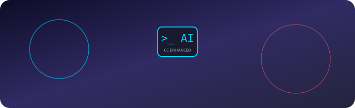
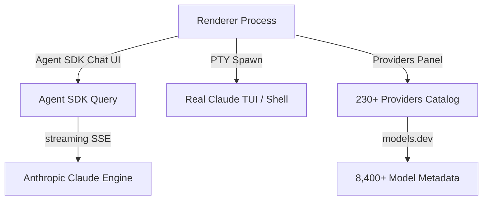

<div align="center">



# Claude Code Enhanced (CCE)

<p align="center">
  <a href="package.json"></a>
  <a href="https://github.com/printezy247/claude-code-enhanced/actions/workflows/ci.yml"></a>
  <a href="https://github.com/printezy247/claude-code-enhanced"></a>
  <a href="https://github.com/printezy247/claude-code-enhanced"></a>
</p>

> **Desktop harness + Agent SDK chat + real TUI terminals + 230+ provider manager — for the Claude CLI.**

</div>

---

## 🏗 Overview



> Chat tabs never patch the CLI — the Agent SDK drives the real `claude` engine.

---

## ✨ Features

<details open>
<summary><b>🎯 Core Desktop Chat</b></summary>

- [x] Streaming responses with live thinking blocks
- [x] Tool-call cards with inline diffs
- [x] Permission prompts in flow
- [x] Model selector mid-conversation
- [x] Mode selector (normal / accept edits / plan / yolo)
- [x] Skills panel + slash-command palette

</details>

<details>
<summary><b>⚡ Terminal Tabs</b></summary>

- [x] Real PTYs with genuine `claude` TUI

</details>

<details>
<summary><b>🌐 Provider Manager</b></summary>

- [x] 230+ providers catalog (models.dev)
- [x] OAuth / API key auth
- [x] Test connection classification

</details>

---

## Install

```bash
# from the repo root
VER=$(node -p "require('./package.json').version")
sudo apt install ./dist/claude-code-enhanced-${VER}-amd64.deb
# or: sudo dpkg -i dist/claude-code-enhanced-${VER}-amd64.deb
```

Launch **Claude Code Enhanced** from your application menu, or run `claude-code-enhanced`.

Requirements: the [claude CLI](https://github.com/anthropics/claude-code)
(`curl -fsSL https://claude.ai/install.sh | bash`) — the app auto-detects it at
`~/.local/bin/claude`, `/usr/local/bin/claude`, etc.; you can override the path in Settings.

## Build from source

```bash
npm install        # also compiles node-pty for Electron
npm start          # run unpackaged
npm test           # vitest: main-process units + renderer (jsdom) tests
npm run smoke      # headless boot check under xvfb
npm run dist       # build dist/claude-code-enhanced-<version>-amd64.deb
```

## Using providers

1. **Providers** panel → **+ Add provider** opens the **Connect** picker. Search 230+ providers
   (every models.dev provider plus curated ones); filter by *Subscriptions / Cloud / Gateways /
   Local*.
2. Pick one. If its URL needs values (Cloudflare account id, Azure resource, an AI Gateway id)
   you are asked for them, then the provider is created and its detail panel opens.
3. In the panel's tabs:
   - **Auth** — paste an API key, or **Sign in** (OAuth / device code). *Test connection* checks
     the credential and lists how many models the provider serves.
   - **Models** — tick what appears in the chat dropdown, set the default model. Metadata
     (context window, cost, tool-calling) comes from models.dev.
   - **Options** — base URL, protocol (Anthropic / OpenAI chat / OpenAI Responses / Gemini),
     auth header, default + small model, extra headers.
   - **Advanced** — lean tool set (for small local models) and extra environment variables.
   - **Diagnostics** — last test result and the exact env a session will get.
4. Star a provider to make it the default; **disable** one to keep it out of pickers.
5. Anthropic subscription users can also just tick **Send /login after launch** in a session.

Secrets are stored in `~/.config/claude-code-enhanced/auth.json` (`0600`, encrypted with the OS
keyring when available) and are **never** written to `config.json`, so the config can be shared.
`~/.config/claude-code-enhanced/config.json` (`0600`) keeps provider records and settings.

Provider quirks worth knowing:
- **Amazon Bedrock** uses a region-templated URL (`bedrock-runtime.${REGION}.amazonaws.com/openai/v1`).
  It has no `GET /models` endpoint, so CCE tests it with a one-token completion probe and lists models
  from the models.dev catalog. Paste a long-term Bedrock API key (starts `ABSK…`); SigV4/IAM-credential
  users should put AWS creds in the environment instead.

## Using connectors

1. **Connectors** panel → pick a scope (`user` = all projects, `project` = `.mcp.json`).
2. Click **Add connector** — it runs `claude mcp add --transport http <name> <url> --scope …`.
3. In any terminal session, run `/mcp` and choose **Authenticate** for the OAuth popup.

## Architecture

```
┌────────────────────────── Electron ──────────────────────────┐
│ renderer                     ↔        main process           │
│  • chat tabs (Agent SDK UI)        • chats.js → @anthropic-   │
│    messages, tool cards,             claude-agent-sdk query() │
│    permissions, model/mode           streaming-input sessions │
│  • terminal tabs (xterm.js)        • sessions.js → node-pty   │
│  • providers / connectors /          spawns `claude` / shell  │
│    settings panels                 • providers env injection  │
└───────────────────────────────────────────────────────────────┘
        ↕ child_process (claude mcp add/list/remove)
   claude CLI config (~/.claude.json, .mcp.json, ~/.claude/skills)
```

Chat tabs never patch the CLI — the Agent SDK drives the real `claude` engine
(streaming input, permission callbacks, session resume), so skills, hooks, MCP
servers and settings from `~/.claude` all apply exactly as in the terminal.

### IPC surface (main ↔ renderer)

The main channels (not exhaustive — see `src/preload/preload.js` for the full bridge):
`session:create/write/resize/kill` · `pty:data` / `pty:exit` events ·
`providers:all/save/delete/default/test` · `provider:listModels` ·
`connectors:presets/list/add/remove` · `settings:get/set` · `clipboard:write` ·
`dialog:pickDir`

### Conversations

The **▤ Conversations** button in the tabbar opens a dropdown covering both open chat/terminal
tabs and every stored session — no separate Sessions or History tabs:

- grouped by the **folder** the conversation ran in, with time buckets (Today / Yesterday /
  Earlier this week / Older) inside each group
- **sort** dropdown (newest / oldest / by name) and a **folder filter**
- **▾ per row**: open, fork, read-only transcript, export to markdown, new chat in that folder,
  delete (two-step confirm)
- clicking a row resumes that session live, with its transcript restored
- `Ctrl+B` toggles the dropdown, `Esc` closes it, clicking outside closes it

## Keyboard

`Ctrl+Shift+T` new session · `Ctrl+Shift+W` close tab · `Ctrl+Tab` next tab ·
`Ctrl+K` command palette · `Ctrl+B` conversation list · `Alt+V` split view ·
`Esc` stop / close panel · `Ctrl+Shift+C/V` copy/paste (terminal tabs only)

## References

- [anthropics/claude-code](https://github.com/anthropics/claude-code) — the wrapped CLI
- [Alishahryar1/free-claude-code](https://github.com/Alishahryar1/free-claude-code) — FCC:
  multi-provider routing + the terminal-first UX this app reproduces
- [shareAI-lab/learn-claude-code](https://github.com/shareAI-lab/learn-claude-code) — CLI
  internals research
- [ChinaSiro/claude-code-sourcemap](https://github.com/ChinaSiro/claude-code-sourcemap) —
  CLI source maps
- [hesreallyhim/awesome-claude-code](https://github.com/hesreallyhim/awesome-claude-code) —
  enhancement ecosystem (commands, hooks, MCP)
- [Donchitos/Claude-Code-Game-Studios](https://github.com/Donchitos/Claude-Code-Game-Studios) —
  workflow/prompt collections
- Connector endpoints: [Supabase remote MCP](https://supabase.com/blog/announcing-supabase-remote-mcp-server),
  [lovablelabs/mcp](https://github.com/lovablelabs/mcp), [GitHub MCP server](https://github.com/github/github-mcp-server)

## Small local models

The claude engine's own base prompt (skills + plugins) is already around 66K tokens, so a chat
needs a context of about 70K or more, and a 3-4B model on a small GPU is slow at that size
(the first turn can take many minutes). Three things in this app attack that:

- **Lean tools** — cut the tool list for one provider (Providers → Edit: three presets or a
  custom per-tool checklist) or globally (Settings → Small local models). Fewer tool schemas
  means a smaller prompt.
- **Tool-call repair** — local models often emit a tool call as prose
  (`<tool_call>{…}</tool_call>` or bare JSON). Local providers are routed through the
  built-in translator proxy, which parses that back into a real tool call.
- **Context sizing** — Ollama loads a model at its own default context (4096 on a 4 GB GPU),
  which silently truncates the engine's prompt and produces nonsense replies. The Ollama
  manager therefore creates a derived copy of the model with the context baked in (default
  72K, see Settings → Local models) and loads that, stepping the size down if it does not fit
  in free RAM. Larger sizes use much more memory (128K needs ~14 GB for a 4B model). **Force
  context** (Settings → Local models, one `model=number` per line) skips the 70K floor for a
  named model — only for models you know; the engine usually rejects turns past a model's real
  context.

Check a model's track record in the model picker: the percentage is measured from your own
tool calls on this machine.

## Tests

`npm test` runs vitest with two harnesses:

- **main process** — `test/stubs/electron.js` replaces Electron, so `src/main/*` runs in plain
  node. `chat:create` uses a fake Agent SDK, and the proxy tests use local fake HTTP servers.
- **renderer** — `test/helpers/renderer.js` boots `index.html` in jsdom, installs a recording
  `ccx` bridge, and evaluates `chat.js` + `app.js` in one shared scope.

No network access and no API keys are required. The same suite runs on every pull request and
every push to `main` via GitHub Actions (`.github/workflows/ci.yml`).

## Troubleshooting

- **`node-pty failed to load`** → `npm run rebuild`
- **Blank window on exotic kernels** → do *not* run with `--no-sandbox`; the default
  Chromium sandbox is required for renderer shared memory on this machine's kernel.
- **claude not found** → Settings → Claude CLI → *Auto-detect*, or install via install.sh.

## 🚀 Roadmap

- [ ] Multi-window (one engine process per window)
- [ ] Streaming Bash output inside tool cards
- [ ] RTK-style output filtering to cut token usage
